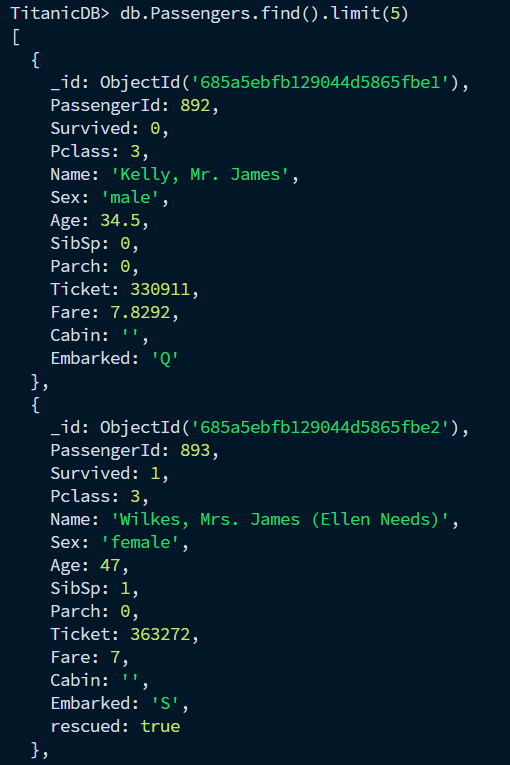
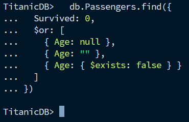
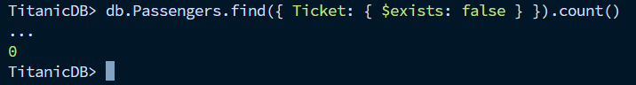

### Exercice 1: Importation et Création de la Collection

###### 1. Créez une base de données nommée TitanicDB

```bash
  use TitanicDB
```

###### 2. Importez les données de titanic.csv dans une collection nommée Passengers

```bash
  mongoimport --db TitanicDB --collection Passengers --type csv --headerline --file titanic.csv
```

Vérification :
```bash
  db.Passengers.find().limit(5)
```

### Exercice 2: Analyse des Données

###### 1. Comptez le nombre total de passagers

```bash
  db.Passengers.countDocuments()
```
```
418
```

###### 2. Trouvez combien de passagers ont survécu

```bash
  db.Passengers.countDocuments({ Survived: 1 })
```
```
152
```

###### 3. Trouvez le nombre de passagers femmes

```bash
  db.Passengers.countDocuments({ Sex: "female" })
```
```
152
```

###### 4. Trouvez le nombre de passagers avec au moins 3 enfants

```bash
  db.Passengers.countDocuments({ Parch: { $gte: 3 } })
```
```
9
```

### Exercice 3: Mise à Jour de Données

###### 1. Mettez à jour les documents pour lesquels le port d'embarquement est manquant, en supposant qu'ils sont montés à bord à Southampton

```bash
  db.Passengers.updateMany({ Embarked: { $in: [null, "", undefined] } },{ $set: { Embarked: "S" } })
```

Vérification :
```bash
  db.Passengers.find({ $or: [{ Embarked: { $exists: false } },{ Embarked: null },{ Embarked: "" }]})
```
```
0
```

###### 2. Ajoutez un champ rescued avec la valeur true pour tous les passagers qui ont survécu

```bash
  db.Passengers.updateMany({ Survived: 1 },{ $set: { rescued: true } })
```

Vérification :\


### Exercice 4: Requêtes Complexes

###### 1. Sélectionnez les noms des 10 passagers les plus jeunes

```bash
  db.Passengers.find({ Age: { $ne: null } },{ Name: 1, Age: 1, _id: 0 }).sort({ Age: 1 }).limit(10)
```

Résultat :
```
[
  { Name: 'Dean, Miss. Elizabeth Gladys Millvina""', Age: 0.17 },
  { Name: 'Danbom, Master. Gilbert Sigvard Emanuel', Age: 0.33 },
  { Name: 'Peacock, Master. Alfred Edward', Age: 0.75 },
  { Name: 'Aks, Master. Philip Frank', Age: 0.83 },
  { Name: 'West, Miss. Barbara J', Age: 0.92 },
  { Name: 'Laroche, Miss. Louise', Age: 1 },
  { Name: 'Klasen, Miss. Gertrud Emilia', Age: 1 },
  { Name: 'Sandstrom, Miss. Beatrice Irene', Age: 1 },
  { Name: 'Wells, Master. Ralph Lester', Age: 2 },
  { Name: 'Rosblom, Miss. Salli Helena', Age: 2 }
]
```

###### 2. Identifiez les passagers qui n'ont pas survécu et qui étaient dans la 2e classe

```bash
  db.Passengers.find({ Survived: 0, Pclass: 2 },{ Name: 1, _id: 0 })
```

Résultat :
```
[
  { Name: 'Myles, Mr. Thomas Francis' },
  { Name: 'Caldwell, Mr. Albert Francis' },
  { Name: 'Howard, Mr. Benjamin' },
  { Name: 'Keane, Mr. Daniel' },
  { Name: 'Louch, Mr. Charles Alexander' },
  { Name: 'Jefferys, Mr. Clifford Thomas' },
  { Name: 'Pulbaum, Mr. Franz' },
  { Name: 'Mangiavacchi, Mr. Serafino Emilio' },
  { Name: 'McCrae, Mr. Arthur Gordon' },
  { Name: 'Aldworth, Mr. Charles Augustus' },
  { Name: 'Lamb, Mr. John Joseph' },
  { Name: 'Wells, Master. Ralph Lester' },
  { Name: 'Weisz, Mr. Leopold' },
  { Name: 'Stanton, Mr. Samuel Ward' },
  { Name: 'Swane, Mr. George' },
  { Name: 'Bowenur, Mr. Solomon' },
  { Name: 'Schmidt, Mr. August' },
  { Name: 'Beauchamp, Mr. Henry James' },
  { Name: 'Lahtinen, Rev. William' },
  { Name: 'Peruschitz, Rev. Joseph Maria' }
]
```

### Exercice 5: Suppression de Données

###### Supprimez les enregistrements des passagers qui n'ont pas survécu et dont l'âge est inconnu

```bash
  db.Passengers.deleteMany({ Survived: 0, Age: { $in: [null, ""] } })
```

Vérification :\


### Exercice 6: Mise à Jour en Masse

###### Utilisez une opération de mise à jour pour augmenter la valeur du champ Age de 1 pour tous les documents

```bash
  db.Passengers.updateMany({ Age: { $type: ["int", "double"] } },[{ $set: { Age: { $add: ["$Age", 1] } } }])
```

### Exercice 7: Suppression Conditionnelle

###### 1. Supprimez tous les documents où le champ Ticket est absent ou vide

```bash
  db.Passengers.deleteMany({ $or: [ { Ticket: { $exists: false } }, { Ticket: null } ] })
```

Vérification :\
