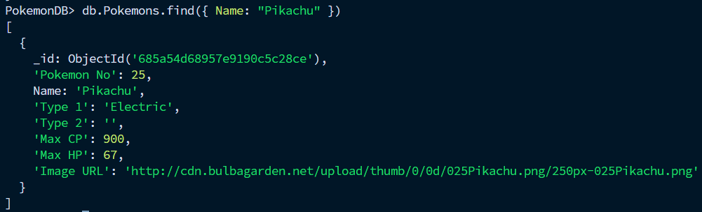
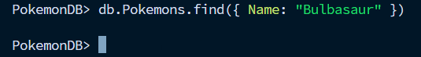

### Exercice 1: Création d'une Base de Données et d'une Collection

###### 1. Lancez mongosh pour démarrer le shell MongoDB

```bash
  mongosh
```

###### 2. Créez une base de données nommée PokemonDB

```bash
  use PokemonDB
```

###### 3. Dans PokemonDB, créez une collection nommée Pokemons

```bash
  db.createCollection("Pokemons")
```

### Exercice 2: Insertion de Données

Dans ~/Documents/Pokemon/
```bash
  mongoimport --db PokemonDB --collection Pokemons --type csv --headerline --file pokemonGO.csv
```

Pour vérifier que les données ont été importé dans la DB (mongosh) 

```bash
  db.Pokemons.find().limit(5)
```

### Exercice 3: Lecture de Données

###### 1. Trouvez tous les Pokémon de type "Feu"

```bash
  db.Pokemons.find({ "Type 1": "Fire" })
```

###### 2. Récupérez les informations du Pokémon nommé "Pikachu"

```bash
  db.Pokemons.find({ Name: "Pikachu" })
```

### Exercice 4: Mise à Jour de Données

```bash
  db.Pokemons.updateOne({ Name: "Pikachu" },{ $set: { "Max CP": 900 } })
```

Vérification : 


### Exercice 5: Suppression d'Éléments

```bash
  db.Pokemons.deleteOne({ Name: "Bulbasaur" })
```

Vérification :
