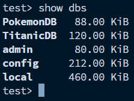
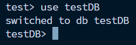
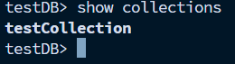
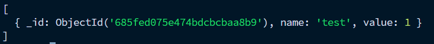
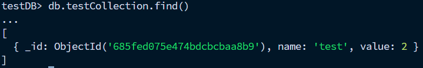
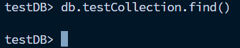
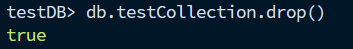
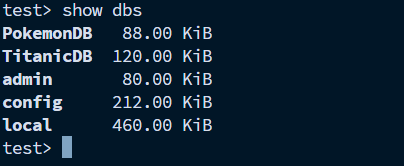

### Partie 1: Exploration des Bases de Données et Collections

###### 1. Connexion : Lancez mongosh pour démarrer le shell MongoDB.

```bash
mongosh
```

###### 2. Lister les Bases de Données : Utilisez la commande show dbs pour afficher toutes les bases de données existantes.

```bash
show dbs
```
Affichage :\


###### 3. Sélectionner une Base de Données : Utilisez la commande use suivie du nom d'une base de données existante ou d'une nouvelle pour la sélectionner.

```bash
use testDB
```

Affichage :\


###### 4. Créer une Collection : Créez une nouvelle collection nommée testCollection en utilisant :

```bash
db.createCollection("testCollection")
```

###### 5. Afficher les Collections : Utilisez la commande show collections pour lister toutes les collections de la base de données actuelle.

```bash
show collections
```
Affichage :\


### Partie 2: Manipulation des Données

###### 1. Insertion de Données : Insérez un document dans testCollection avec :

```bash
db.testCollection.insertOne({name: "test", value: 1})
```
###### 2. Lecture de Données : Utilisez db.testCollection.find() pour afficher tous les documents dans testCollection.

```bash
db.testCollection.find()
```
Affichage :\


###### 3. Mise à Jour de Données : Mettez à jour le document précédemment inséré en augmentant value de 1 avec :

```bash
db.testCollection.updateOne({name: "test"}, {$inc: {value: 1}})
```
Vérification :\


###### 4. Suppression de Données : Supprimez le document avec :

```bash
db.testCollection.deleteOne({name: "test"})
```
Vérification :\


### Partie 3: Nettoyage

###### 1. Suppression de Collection : Supprimez testCollection en utilisant :
```bash
db.testCollection.drop()
```
Affichage :\


###### 2. Suppression de Base de Données : Supprimez la base de données testDB (assurez-vous d'avoir sélectionné testDB) avec :
```bash
db.dropDatabase()
```

Vérification :\



